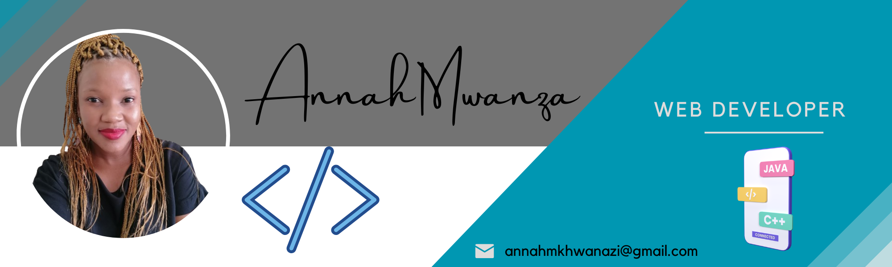

AnnahNokutheza `README.md`

I am a highly skilled and motivated Web Developer specializing in frontend development with a passion for crafting visually appealing, clean, and user-friendly web experiences. I have over 5 years’ experience working with WordPress and 2 years with HTML. My knowledge in HTML, CSS, JavaScript, Bootstrap, and modern frontend frameworks like REACT has given me the freedom to design, debug, and code responsive web pages for mobile and desktop. With my professional knowledge of WordPress plugin development, architecture, and standards, I designed eye-catching websites for clients. As a developer, I am committed to continuous learning and staying up-to-date with the latest industry trends. I believe that I am an asset to your company. Hire me.

- 🔭 I’m currently working on my own projects
- 👯 I’m looking to collaborate on frontend & backend projects
- 📫 Reach me on social media platforms
- ⚡ Fun fact: I love challenging projects
